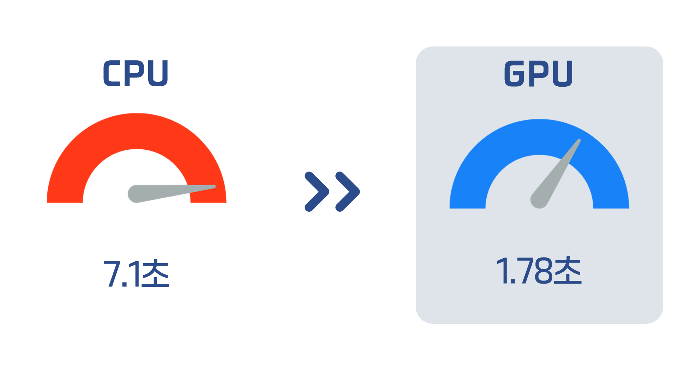
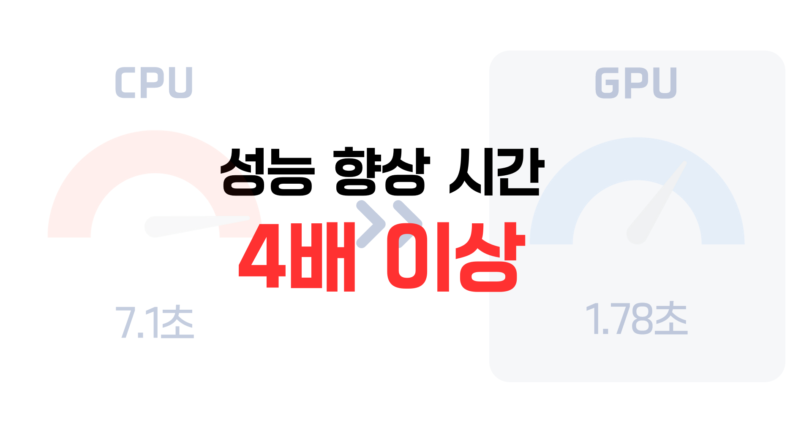
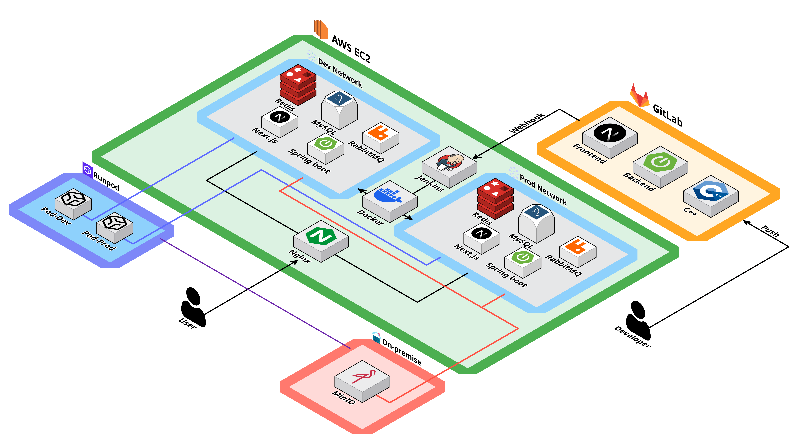
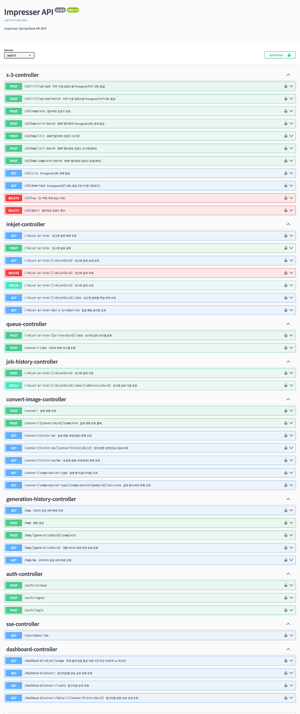
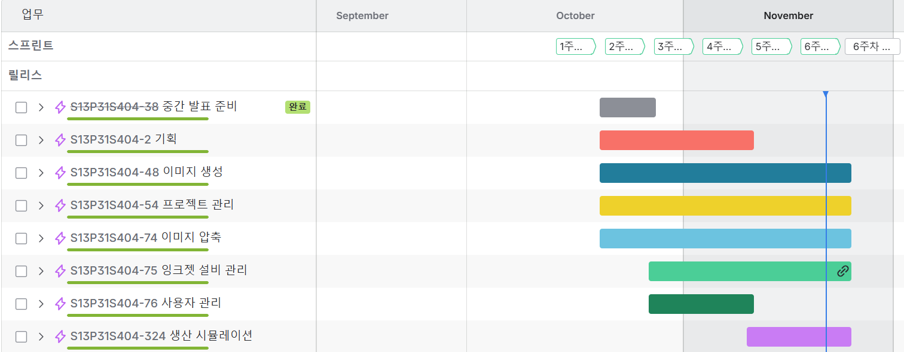
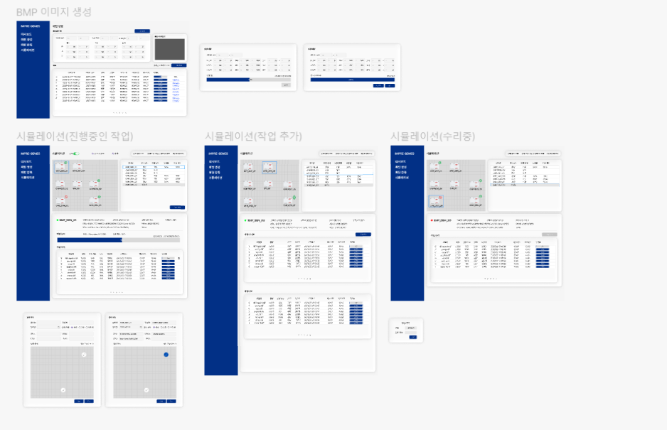

<div align="center"> 
  
</div>

## IMPRESSER
**GPU 기반 이미지 가속 압축 소프트웨어 개발**

- Samsung Software AI Academy For Youth 13기 자율 프로젝트
- 세메스 기업 연계 프로젝트
- 프로젝트 기간: 2025.10.06 ~ 2025.11.21
- 참여 인원: 5명

<br>

## 🚀 프로젝트 소개

### 배경
디스플레이 패널 생산에는 RGB 패턴 이미지가 필요하며, 이를 위해 BMP 파일을 TIFF 형식으로 압축해 활용합니다.  
기존 세메스 시스템은 CPU 기반 압축 방식을 사용하여 처리 속도와 성능에 한계가 있었습니다.

### 목적
GPU를 활용하여 **고속·고효율 이미지 압축**을 수행하는 Impresser 서비스를 개발하고, 기존 대비 압축 속도를 획기적으로 개선합니다.
<div align="center" style="display: flex; justify-content: center; gap: 20px; flex-wrap: wrap;">
  
  
</div>

### 핵심 대상
제조 장비 소프트웨어 기업

### 특징 및 차별점
- **GPU 가속 이미지 압축**
- **CPU 대비 최대 4배 빠른 속도**
- **비동기 압축 대기열(Queue)** 지원
- **BMP 패턴 이미지 생성 기능 제공**
- **압축 성능 비교 시뮬레이션 제공**


<br>

## 👨‍👩‍👧‍👦 팀원 소개

### Backend
<div align="center">
  <table style="border-collapse: collapse;">
    <tbody>
      <tr>
        <td align="center" style="border: none; padding: 15px; vertical-align: top; width: 180px;">
          <a href="#">
            
          </a><br>
          <b><sub>김나경 (Leader)</sub></b><br>
          <sub><a href="https://github.com/iqveou6">@김나경</a></sub><br><br>
          
          <br><br>
          <div align="left">
            <small>
              <ul style="margin: 0; padding-left: 20px; line-height: 1.5;">
                <li>잉크젯 설비</li>
                <li>libTIFF 기반 이미지 압축</li>
                <li>이미지 압축 및 설비 대기열</li>
              </ul>
            </small>
          </div>
        </td>
        <td align="center" style="border: none; padding: 15px; vertical-align: top; width: 180px;">
          <a href="#">
            
          </a><br>
          <b><sub>김환수</sub></b><br>
          <sub><a href="https://github.com/KimHS17">@김환수</a></sub><br><br>
          
          
          <br><br>
          <div align="left">
            <small>
              <ul style="margin: 0; padding-left: 20px; line-height: 1.5;">
                <li>CI/CD 파이프라인 구축</li>
                <li>nvTIFF 기반 이미지 압축</li>
                <li>로그인/Security</li>
              </ul>
            </small>
          </div>
        </td>
        <td align="center" style="border: none; padding: 15px; vertical-align: top; width: 180px;">
          <a href="#">
            
          </a><br>
          <b><sub>이희산</sub></b><br>
          <sub><a href="https://github.com/Lee-heesan">@이희산</a></sub><br><br>
          
          <br><br>
          <div align="left">
            <small>
              <ul style="margin: 0; padding-left: 20px; line-height: 1.5;">
                <li>대시보드 및 압축/변환 내역 조회</li>
                <li>CUDA 기반 이미지 생성</li>
                <li>S3 대용량 다중 이미지 업로드</li>
              </ul>
            </small>
          </div>
        </td>
      </tr>
    </tbody>
  </table>
</div>

### Frontend
<div align="center">
  <table style="border-collapse: collapse;">
    <tbody>
      <tr>
        <td align="center" style="border: none; padding: 15px; vertical-align: top; width: 180px;">
          <a href="#">
            
          </a><br>
          <b><sub>박지현</sub></b><br>
          <sub><a href="https://github.com/gorjheous">@박지현</a></sub><br><br>
          
          
          <br><br>
          <div align="left">
            <small>
              <ul style="margin: 0; padding-left: 20px; line-height: 1.5;">
                <li>생산 시뮬레이션 구현</li>
                <li>압축 성능 비교</li>
                <li>로그인/이미지 압축 화면 디자인</li>
              </ul>
            </small>
          </div>
        </td>
        <td align="center" style="border: none; padding: 15px; vertical-align: top; width: 180px;">
          <a href="#">
            
          </a><br>
          <b><sub>윤혜진</sub></b><br>
          <sub><a href="https://github.com/g2pwls">@윤혜진</a></sub><br><br>
          
          
          <br><br>
          <div align="left">
            <small>
              <ul style="margin: 0; padding-left: 20px; line-height: 1.5;">
                <li>로그인 API 연결</li>
                <li>대시보드</li>
                <li>이미지 생성/이미지 압축</li>
              </ul>
            </small>
          </div>
        </td>
        <td style="border: none; padding: 15px; width: 180px;">&nbsp;</td>
      </tr>
    </tbody>
  </table>
</div>


<br>

## 🛠 기술 스택

<div align="center">

### Backend


<br>


### Image


### Frontend


### DevOps / Infra


### Tools


</div>

<br>

## 📌 주요 기능

<div align="center"> 
  <table border="1" cellspacing="0" cellpadding="5" 
         style="border-collapse: collapse; width: 100%; text-align: center; vertical-align: middle;">
    <thead> 
      <tr> 
        <th style="text-align:center;">로그인</th> 
        <th style="text-align:center;">대시보드</th> 
      </tr>
    </thead>
    <tbody>
      <tr> 
        <td style="text-align:center;"></td> 
        <td style="text-align:center;"></td> 
      </tr>
      <tr> 
        <th style="text-align:center;">패턴 생성 미리보기</th> 
        <th style="text-align:center;">csv 불러오기</th>
      </tr>
      <tr> 
      <td style="text-align:center;"></td> 
      <td style="text-align:center;"></td> 
      </tr>
      <tr> 
        <th style="text-align:center;">패턴 생성</th> 
        <th style="text-align:center;">이미지 압축</th> 
      </tr>
      <tr> 
      <td style="text-align:center;"></td> 
        <td style="text-align:center;"></td> 
      </tr>
      <tr> 
        <th style="text-align:center;">성능 비교</th> 
        <th style="text-align:center;">설비 등록</th> 
      </tr>
      <tr> 
        <td style="text-align:center;"></td> 
        <td style="text-align:center;"></td> 
      </tr>
      <tr> 
        <th style="text-align:center;">시뮬레이션</th> 
      </tr>
      <tr> 
        <td style="text-align:center;"></td> 
      </tr>
    </tbody>
  </table>
</div>

<br>

## 📂 프로젝트 구조

<details>
<summary>&nbsp FRONTEND</summary>

```
📂 frontend
 ┣ 📂 public
 ┃ ┣ 📂 fonts
 ┃ ┣ 📂 images
 ┃ ┃ ┣ 📂 facilities
 ┃ ┃ ┣ 📂 logos
 ┃ ┃ ┗ 📂 products
 ┃ ┣ 📄 csvlogo.png
 ┃ ┣ 📄 file.svg
 ┃ ┣ 📄 globe.svg
 ┃ ┣ 📄 next.svg
 ┃ ┣ 📄 pattern-template.csv
 ┃ ┣ 📄 vercel.svg
 ┃ ┗ 📄 window.svg
 ┣ 📂 src
 ┃ ┣ 📂 app
 ┃ ┃ ┣ 📂 dashboard
 ┃ ┃ ┃ ┣ 📂 components
 ┃ ┃ ┃ ┃ ┣ 📄 Compressionlist.tsx
 ┃ ┃ ┃ ┃ ┣ 📄 PerformanceRanking.tsx
 ┃ ┃ ┃ ┃ ┗ 📄 RecommendationEngine.tsx
 ┃ ┃ ┃ ┗ 📄 page.tsx
 ┃ ┃ ┣ 📂 imagecompressor
 ┃ ┃ ┃ ┣ 📂 components
 ┃ ┃ ┃ ┃ ┣ 📄 CompressionHistory.tsx
 ┃ ┃ ┃ ┃ ┣ 📄 CompressionQueue.tsx
 ┃ ┃ ┃ ┃ ┗ 📄 CompressionSettings.tsx
 ┃ ┃ ┃ ┗ 📄 page.tsx
 ┃ ┃ ┣ 📂 imagegenerator
 ┃ ┃ ┃ ┣ 📂 components
 ┃ ┃ ┃ ┃ ┣ 📄 PatternGenerator.tsx
 ┃ ┃ ┃ ┃ ┣ 📄 PatternList.tsx
 ┃ ┃ ┃ ┃ ┣ 📄 PatternPreview.tsx
 ┃ ┃ ┃ ┃ ┗ 📄 PatternPreviewModal.tsx
 ┃ ┃ ┃ ┗ 📄 page.tsx
 ┃ ┃ ┣ 📂 login
 ┃ ┃ ┃ ┣ 📂 components
 ┃ ┃ ┃ ┃ ┣ 📄 LoginBackground.tsx
 ┃ ┃ ┃ ┃ ┣ 📄 LoginBrandSection.tsx
 ┃ ┃ ┃ ┃ ┣ 📄 logincontain.tsx
 ┃ ┃ ┃ ┃ ┗ 📄 loginfindmodal.tsx
 ┃ ┃ ┃ ┗ 📄 page.tsx
 ┃ ┃ ┣ 📂 performance
 ┃ ┃ ┃ ┣ 📂 components
 ┃ ┃ ┃ ┃ ┣ 📄 AddFacilityModal.tsx
 ┃ ┃ ┃ ┃ ┣ 📄 AlgorithmOptions.tsx
 ┃ ┃ ┃ ┃ ┣ 📄 EditFacilityModal.tsx
 ┃ ┃ ┃ ┃ ┣ 📄 FacilityDetailPanel.tsx
 ┃ ┃ ┃ ┃ ┣ 📄 FacilityFileUpload.tsx
 ┃ ┃ ┃ ┃ ┣ 📄 FacilityHistorySection.tsx
 ┃ ┃ ┃ ┃ ┣ 📄 FacilityHistoryTable.tsx
 ┃ ┃ ┃ ┃ ┣ 📄 FacilityInfoSection.tsx
 ┃ ┃ ┃ ┃ ┣ 📄 FacilityQueueSection.tsx
 ┃ ┃ ┃ ┃ ┣ 📄 FacilityQueueTable.tsx
 ┃ ┃ ┃ ┃ ┣ 📄 FacilityStatisticsSummary.tsx
 ┃ ┃ ┃ ┃ ┣ 📄 FacilityWorkUpload.tsx
 ┃ ┃ ┃ ┃ ┣ 📄 IsometricMap.tsx
 ┃ ┃ ┃ ┃ ┣ 📄 NewFacilityList.tsx
 ┃ ┃ ┃ ┃ ┣ 📄 PerformanceResultComparisonTable.tsx
 ┃ ┃ ┃ ┃ ┣ 📄 PerformanceResultSummary.tsx
 ┃ ┃ ┃ ┃ ┣ 📄 PerformanceSimulator.tsx
 ┃ ┃ ┃ ┃ ┣ 📄 PerformanceSimulatorCard.tsx
 ┃ ┃ ┃ ┃ ┣ 📄 PerformanceSimulatorSettings.tsx
 ┃ ┃ ┃ ┃ ┣ 📄 PerformanceSimulatorSlot.tsx
 ┃ ┃ ┃ ┃ ┣ 📄 SelectedFacilitiesPanel.tsx
 ┃ ┃ ┃ ┃ ┣ 📄 ThreeIsometricMap.tsx
 ┃ ┃ ┃ ┃ ┗ 📄 TileMap.tsx
 ┃ ┃ ┃ ┣ 📄 page.tsx
 ┃ ┃ ┃ ┗ 📄 types.ts
 ┃ ┃ ┣ 📂 simulation
 ┃ ┃ ┃ ┣ 📂 components
 ┃ ┃ ┃ ┃ ┣ 📄 BmpImportModal.tsx
 ┃ ┃ ┃ ┃ ┣ 📄 ConfirmedGoalTable.tsx
 ┃ ┃ ┃ ┃ ┣ 📄 InkConsumptionSummary.tsx
 ┃ ┃ ┃ ┃ ┣ 📄 LayoutSlider.tsx
 ┃ ┃ ┃ ┃ ┣ 📄 MotherGlassInfoList.tsx
 ┃ ┃ ┃ ┃ ┣ 📄 MotherGlassLayoutPreview.tsx
 ┃ ┃ ┃ ┃ ┣ 📄 MotherGlassSelector.tsx
 ┃ ┃ ┃ ┃ ┣ 📄 OverallProductionSummary.tsx
 ┃ ┃ ┃ ┃ ┣ 📄 PrintSimulationPlan.tsx
 ┃ ┃ ┃ ┃ ┣ 📄 ProductCard.tsx
 ┃ ┃ ┃ ┃ ┣ 📄 ProductList.tsx
 ┃ ┃ ┃ ┃ ┣ 📄 ProductQuantityModal.tsx
 ┃ ┃ ┃ ┃ ┣ 📄 ProductionGoalList.tsx
 ┃ ┃ ┃ ┃ ┗ 📄 SelectedGoalList.tsx
 ┃ ┃ ┃ ┣ 📂 data
 ┃ ┃ ┃ ┣ 📂 utils
 ┃ ┃ ┃ ┣ 📂 workers
 ┃ ┃ ┃ ┣ 📄 page.tsx
 ┃ ┃ ┃ ┗ 📄 types.ts
 ┃ ┃ ┣ 📂 test
 ┃ ┃ ┣ 📂 test001
 ┃ ┃ ┣ 📂 test004
 ┃ ┃ ┣ 📄 dashboard-layout-example.tsx
 ┃ ┃ ┣ 📄 favicon.ico
 ┃ ┃ ┣ 📄 globals.css
 ┃ ┃ ┣ 📄 group-routes-example.md
 ┃ ┃ ┣ 📄 layout.tsx
 ┃ ┃ ┣ 📄 loading.tsx
 ┃ ┃ ┗ 📄 page.tsx
 ┃ ┣ 📂 components
 ┃ ┃ ┣ 📂 auth
 ┃ ┃ ┃ ┗ 📄 AuthGuard.tsx
 ┃ ┃ ┣ 📂 layout
 ┃ ┃ ┃ ┣ 📄 navbar.tsx
 ┃ ┃ ┃ ┗ 📄 sidebar.tsx
 ┃ ┃ ┣ 📂 ui
 ┃ ┃ ┃ ┣ 📄 CommonButton.tsx
 ┃ ┃ ┃ ┣ 📄 CommonCheckBox.tsx
 ┃ ┃ ┃ ┣ 📄 CommonContainerBox.tsx
 ┃ ┃ ┃ ┣ 📄 CommonDropdown.tsx
 ┃ ┃ ┃ ┣ 📄 CommonInput01.tsx
 ┃ ┃ ┃ ┣ 📄 CommonLoader.tsx
 ┃ ┃ ┃ ┣ 📄 CommonModal.tsx
 ┃ ┃ ┃ ┣ 📄 CommonPagination.tsx
 ┃ ┃ ┃ ┣ 📄 CommonRadioButton.tsx
 ┃ ┃ ┃ ┣ 📄 CommonTable.tsx
 ┃ ┃ ┃ ┣ 📄 CommonTableFrame.tsx
 ┃ ┃ ┃ ┣ 📄 CommonToast.tsx
 ┃ ┃ ┃ ┣ 📄 FlatContainerBox.tsx
 ┃ ┃ ┃ ┣ 📄 GlassButton01.tsx
 ┃ ┃ ┃ ┗ 📄 GlassButton02.tsx
 ┃ ┃ ┗ 📄 GlobalSSENotifications.tsx
 ┃ ┣ 📂 contexts
 ┃ ┃ ┗ 📄 SSEContext.tsx
 ┃ ┣ 📂 service
 ┃ ┃ ┣ 📄 auth.ts
 ┃ ┃ ┣ 📄 dashboard.ts
 ┃ ┃ ┣ 📄 globalSSEService.ts
 ┃ ┃ ┣ 📄 imageCompressor.ts
 ┃ ┃ ┣ 📄 imageGenerator.ts
 ┃ ┃ ┣ 📄 imageUpload.ts
 ┃ ┃ ┗ 📄 inkjet.ts
 ┃ ┣ 📂 store
 ┃ ┃ ┣ 📄 authStore.ts
 ┃ ┃ ┣ 📄 imageCompressorStore.ts
 ┃ ┃ ┣ 📄 imageGeneratorStore.ts
 ┃ ┃ ┣ 📄 imageUploadStore.ts
 ┃ ┃ ┣ 📄 performanceHistoryStore.ts
 ┃ ┃ ┣ 📄 performanceRankingStore.ts
 ┃ ┃ ┗ 📄 sidebarStore.ts
 ┃ ┣ 📂 types
 ┃ ┃ ┣ 📄 auth.ts
 ┃ ┃ ┣ 📄 dashboard.ts
 ┃ ┃ ┣ 📄 imageCompressor.ts
 ┃ ┃ ┣ 📄 imageGenerator.ts
 ┃ ┃ ┗ 📄 imageUpload.ts
 ┃ ┗ 📂 utils
 ┃   ┗ 📄 fetchWithAuth.ts
 ┣ 📄 .prettierignore
 ┣ 📄 .prettierrc
 ┣ 📄 Dockerfile
 ┣ 📄 eslint.config.mjs
 ┣ 📄 next.config.ts
 ┣ 📄 package.json
 ┣ 📄 pnpm-lock.yaml
 ┣ 📄 postcss.config.mjs
 ┗ 📄 tsconfig.json
```
</details>
<br>

<details>
<summary>&nbsp BACKEND</summary>

```
📂 backend
 ┣ 📂 src/main/java/com/semes/impresser
 ┃ ┣ 📂 auth
 ┃ ┃ ┣ 📂 controller
 ┃ ┃ ┃ ┗ 📄 AuthController.java
 ┃ ┃ ┣ 📂 dto
 ┃ ┃ ┃ ┣ 📂 request
 ┃ ┃ ┃ ┃ ┗ 📄 LoginRequest.java
 ┃ ┃ ┃ ┗ 📂 response
 ┃ ┃ ┃ ┃ ┣ 📄 LoginResponse.java
 ┃ ┃ ┃ ┃ ┗ 📄 ReissueTokenResponse.java
 ┃ ┃ ┗ 📂 service
 ┃ ┃ ┃ ┣ 📄 AuthService.java
 ┃ ┃ ┃ ┗ 📄 AuthServiceImpl.java
 ┃ ┣ 📂 common
 ┃ ┃ ┣ 📂 client
 ┃ ┃ ┃ ┣ 📂 dto
 ┃ ┃ ┃ ┃ ┣ 📂 request
 ┃ ┃ ┃ ┃ ┃ ┣ 📄 ConvertImageRequest.java
 ┃ ┃ ┃ ┃ ┃ ┗ 📄 GenerateImageApiRequest.java
 ┃ ┃ ┃ ┃ ┗ 📂 response
 ┃ ┃ ┃ ┃ ┃ ┣ 📄 ConvertImageResponse.java
 ┃ ┃ ┃ ┃ ┃ ┗ 📄 GenerateImageApiResponse.java
 ┃ ┃ ┃ ┗ 📄 ExternalApiClient.java
 ┃ ┃ ┣ 📂 config
 ┃ ┃ ┃ ┣ 📄 AsyncConfig.java
 ┃ ┃ ┃ ┣ 📄 CorsConfig.java
 ┃ ┃ ┃ ┣ 📄 HttpClientConfig.java
 ┃ ┃ ┃ ┣ 📄 QuerydslConfig.java
 ┃ ┃ ┃ ┣ 📄 RabbitMQConfig.java
 ┃ ┃ ┃ ┣ 📄 S3Config.java
 ┃ ┃ ┃ ┣ 📄 SecurityConfig.java
 ┃ ┃ ┃ ┗ 📄 SwaggerConfig.java
 ┃ ┃ ┣ 📂 controller
 ┃ ┃ ┃ ┗ 📄 SseController.java
 ┃ ┃ ┣ 📂 entity
 ┃ ┃ ┃ ┣ 📄 BaseEntity.java
 ┃ ┃ ┃ ┗ 📄 BaseTimeEntity.java
 ┃ ┃ ┣ 📂 exception
 ┃ ┃ ┃ ┣ 📄 BusinessException.java
 ┃ ┃ ┃ ┣ 📄 ErrorCode.java
 ┃ ┃ ┃ ┗ 📄 GlobalExceptionHandler.java
 ┃ ┃ ┣ 📂 repository
 ┃ ┃ ┃ ┗ 📄 EmitterRepository.java
 ┃ ┃ ┣ 📂 response
 ┃ ┃ ┃ ┣ 📄 BaseResponse.java
 ┃ ┃ ┃ ┣ 📄 PageResponse.java
 ┃ ┃ ┃ ┗ 📄 PaginationResponse.java
 ┃ ┃ ┣ 📂 security
 ┃ ┃ ┃ ┣ 📄 CustomAccessDeniedHandler.java
 ┃ ┃ ┃ ┣ 📄 CustomAuthenticationEntryPoint.java
 ┃ ┃ ┃ ┗ 📄 JwtAuthenticationFilter.java
 ┃ ┃ ┣ 📂 service
 ┃ ┃ ┃ ┗ 📄 SseService.java
 ┃ ┃ ┗ 📂 util
 ┃ ┃ ┃ ┣ 📄 CookieUtil.java
 ┃ ┃ ┃ ┣ 📄 JwtUtil.java
 ┃ ┃ ┃ ┣ 📄 S3Util.java
 ┃ ┃ ┃ ┗ 📄 SecurityUtil.java
 ┃ ┣ 📂 convertImage
 ┃ ┃ ┣ 📂 controller
 ┃ ┃ ┃ ┗ 📄 ConvertImageController.java
 ┃ ┃ ┣ 📂 dto
 ┃ ┃ ┃ ┣ 📂 request
 ┃ ┃ ┃ ┃ ┣ 📄 CompleteConvertRequest.java
 ┃ ┃ ┃ ┃ ┗ 📄 CreateConvertRequest.java
 ┃ ┃ ┃ ┗ 📂 response
 ┃ ┃ ┃ ┃ ┣ 📄 CompleteConvertResponse.java
 ┃ ┃ ┃ ┃ ┣ 📄 CompressionTypeResponse.java
 ┃ ┃ ┃ ┃ ┣ 📄 CompressionTypeVersionResponse.java
 ┃ ┃ ┃ ┃ ┣ 📄 ConvertHistoryDetailResponse.java
 ┃ ┃ ┃ ┃ ┣ 📄 ConvertHistoryItemResponse.java
 ┃ ┃ ┃ ┃ ┗ 📄 CreateConvertResponse.java
 ┃ ┃ ┣ 📂 entity
 ┃ ┃ ┃ ┣ 📄 CompressionType.java
 ┃ ┃ ┃ ┗ 📄 ConvertHistory.java
 ┃ ┃ ┣ 📂 repository
 ┃ ┃ ┃ ┣ 📄 CompressionTypeRepository.java
 ┃ ┃ ┃ ┣ 📄 CompressionTypeRepositoryCustom.java
 ┃ ┃ ┃ ┣ 📄 CompressionTypeRepositoryCustomImpl.java
 ┃ ┃ ┃ ┣ 📄 ConvertHistoryRepository.java
 ┃ ┃ ┃ ┣ 📄 ConvertHistoryRepositoryCustom.java
 ┃ ┃ ┃ ┗ 📄 ConvertHistoryRepositoryCustomImpl.java
 ┃ ┃ ┗ 📂 service
 ┃ ┃ ┃ ┣ 📄 ConvertImageService.java
 ┃ ┃ ┃ ┗ 📄 ConvertImageServiceImpl.java
 ┃ ┣ 📂 dashboard
 ┃ ┃ ┣ 📂 controller
 ┃ ┃ ┃ ┗ 📄 DashboardController.java
 ┃ ┃ ┣ 📂 dto/response
 ┃ ┃ ┃ ┣ 📄 ConvertAvgSpeedListResponse.java
 ┃ ┃ ┃ ┣ 📄 ConvertHistoryDetailResponse.java
 ┃ ┃ ┃ ┣ 📄 ConvertHistoryListResponse.java
 ┃ ┃ ┃ ┣ 📄 InkjetDailyUsageCompareResponse.java
 ┃ ┃ ┃ ┣ 📄 InkjetDailyUsageResponse.java
 ┃ ┃ ┃ ┣ 📄 InkjetDailyUsageStatResponse.java
 ┃ ┃ ┃ ┗ 📄 InkjetWeeklyUsageResponse.java
 ┃ ┃ ┗ 📂 service
 ┃ ┃ ┃ ┣ 📄 DashboardService.java
 ┃ ┃ ┃ ┗ 📄 DashboardServiceImpl.java
 ┃ ┣ 📂 generateImage
 ┃ ┃ ┣ 📂 controller
 ┃ ┃ ┃ ┗ 📄 GenerationHistoryController.java
 ┃ ┃ ┣ 📂 dto
 ┃ ┃ ┃ ┣ 📂 request
 ┃ ┃ ┃ ┃ ┣ 📄 CompleteBmpGernerationRequest.java
 ┃ ┃ ┃ ┃ ┗ 📄 CreateBmpImageRequest.java
 ┃ ┃ ┃ ┗ 📂 response
 ┃ ┃ ┃ ┃ ┣ 📄 AllGenerationHistoryResponse.java
 ┃ ┃ ┃ ┃ ┣ 📄 CreateBmpImageAsyncResponse.java
 ┃ ┃ ┃ ┃ ┣ 📄 CreateBmpImageResponse.java
 ┃ ┃ ┃ ┃ ┗ 📄 GenerationHistoryResponse.java
 ┃ ┃ ┣ 📂 entity
 ┃ ┃ ┃ ┣ 📄 GenerationHistory.java
 ┃ ┃ ┃ ┗ 📄 GenerationStatus.java
 ┃ ┃ ┣ 📂 repository
 ┃ ┃ ┃ ┣ 📄 GenerationHistoryRepository.java
 ┃ ┃ ┃ ┣ 📄 GenerationHistoryRepositoryCustom.java
 ┃ ┃ ┃ ┗ 📄 GenerationHistoryRepositoryCustomImpl.java
 ┃ ┃ ┗ 📂 service
 ┃ ┃ ┃ ┣ 📄 GenerateImageTransactionalService.java
 ┃ ┃ ┃ ┣ 📄 GenerateImageWorker.java
 ┃ ┃ ┃ ┣ 📄 GenerationHistoryService.java
 ┃ ┃ ┃ ┗ 📄 GenerationHistoryServiceImpl.java
 ┃ ┣ 📂 inkjet
 ┃ ┃ ┣ 📂 controller
 ┃ ┃ ┃ ┣ 📄 InkjetController.java
 ┃ ┃ ┃ ┗ 📄 JobHistoryController.java
 ┃ ┃ ┣ 📂 dto
 ┃ ┃ ┃ ┣ 📂 request
 ┃ ┃ ┃ ┃ ┣ 📄 CreateInkjetRequest.java
 ┃ ┃ ┃ ┃ ┣ 📄 CreateJobHistoryRequest.java
 ┃ ┃ ┃ ┃ ┗ 📄 UpdateInkjetRequest.java
 ┃ ┃ ┃ ┗ 📂 response
 ┃ ┃ ┃ ┃ ┣ 📄 AllInkjetResponse.java
 ┃ ┃ ┃ ┃ ┣ 📄 CreateJobHistoryResponse.java
 ┃ ┃ ┃ ┃ ┣ 📄 InkjetResponse.java
 ┃ ┃ ┃ ┃ ┣ 📄 JobHistoryListResponse.java
 ┃ ┃ ┃ ┃ ┣ 📄 JobHistoryResponse.java
 ┃ ┃ ┃ ┃ ┗ 📄 TotalJobResponse.java
 ┃ ┃ ┣ 📂 entity
 ┃ ┃ ┃ ┣ 📄 InkjetPrinter.java
 ┃ ┃ ┃ ┣ 📄 InkjetPrinterSlot.java
 ┃ ┃ ┃ ┣ 📄 JobHistory.java
 ┃ ┃ ┃ ┣ 📄 PrinterStatus.java
 ┃ ┃ ┃ ┣ 📄 ProcessStatus.java
 ┃ ┃ ┃ ┗ 📄 SlotStatus.java
 ┃ ┃ ┣ 📂 repository
 ┃ ┃ ┃ ┣ 📄 InkjetRepository.java
 ┃ ┃ ┃ ┣ 📄 InkjetRepositoryCustom.java
 ┃ ┃ ┃ ┣ 📄 InkjetRepositoryCustomImpl.java
 ┃ ┃ ┃ ┣ 📄 InkjetSlotRepository.java
 ┃ ┃ ┃ ┣ 📄 InkjetSlotRepositoryCustom.java
 ┃ ┃ ┃ ┣ 📄 InkjetSlotRepositoryCustomImpl.java
 ┃ ┃ ┃ ┗ 📄 JobHistoryRepository.java
 ┃ ┃ ┗ 📂 service
 ┃ ┃ ┃ ┣ 📄 InkjetService.java
 ┃ ┃ ┃ ┣ 📄 InkjetServiceImpl.java
 ┃ ┃ ┃ ┣ 📄 InkjetSlotService.java
 ┃ ┃ ┃ ┣ 📄 InkjetSlotServiceImpl.java
 ┃ ┃ ┃ ┣ 📄 JobHistoryService.java
 ┃ ┃ ┃ ┗ 📄 JobHistoryServiceImpl.java
 ┃ ┣ 📂 queue
 ┃ ┃ ┣ 📂 controller
 ┃ ┃ ┃ ┗ 📄 QueueController.java
 ┃ ┃ ┣ 📂 dto
 ┃ ┃ ┃ ┣ 📄 CompressImageMessage.java
 ┃ ┃ ┃ ┣ 📄 ConvertRequest.java
 ┃ ┃ ┃ ┗ 📄 PrintRequest.java
 ┃ ┃ ┣ 📂 producer
 ┃ ┃ ┃ ┣ 📄 ImageMessageProducer.java
 ┃ ┃ ┃ ┗ 📄 PrintMessageProducer.java
 ┃ ┃ ┗ 📂 service
 ┃ ┃ ┃ ┣ 📄 QueueService.java
 ┃ ┃ ┃ ┗ 📄 QueueServiceImpl.java
 ┃ ┣ 📂 s3
 ┃ ┃ ┣ 📂 controller
 ┃ ┃ ┃ ┗ 📄 S3Controller.java
 ┃ ┃ ┣ 📂 dto
 ┃ ┃ ┃ ┣ 📂 request
 ┃ ┃ ┃ ┃ ┣ 📄 CompleteBatchRequest.java
 ┃ ┃ ┃ ┃ ┣ 📄 CompleteMultipartRequest.java
 ┃ ┃ ┃ ┃ ┣ 📄 CreateTiffUploadsRequest.java
 ┃ ┃ ┃ ┃ ┣ 📄 InitBmpBatchRequest.java
 ┃ ┃ ┃ ┃ ┣ 📄 PresignedUrlRequest.java
 ┃ ┃ ┃ ┃ ┣ 📄 TiffUploadItemRequest.java
 ┃ ┃ ┃ ┃ ┗ 📄 UrlsBatchRequest.java
 ┃ ┃ ┃ ┗ 📂 response
 ┃ ┃ ┃ ┃ ┣ 📄 CompleteBatchResultResponse.java
 ┃ ┃ ┃ ┃ ┣ 📄 CreateTiffUploadResponse.java
 ┃ ┃ ┃ ┃ ┣ 📄 InitBmpBatchResponse.java
 ┃ ┃ ┃ ┃ ┣ 📄 InitMultipartUploadResponse.java
 ┃ ┃ ┃ ┃ ┣ 📄 PresignedUrlListResponse.java
 ┃ ┃ ┃ ┃ ┣ 📄 PresignedUrlResponse.java
 ┃ ┃ ┃ ┃ ┣ 📄 UrlsBatchItemResponse.java
 ┃ ┃ ┃ ┃ ┗ 📄 UrlsBatchResponse.java
 ┃ ┃ ┗ 📂 service
 ┃ ┃ ┃ ┣ 📄 FilePresignedService.java
 ┃ ┃ ┃ ┗ 📄 FilePresignedServiceImpl.java
 ┃ ┣ 📂 user
 ┃ ┃ ┣ 📂 entity
 ┃ ┃ ┃ ┣ 📄 User.java
 ┃ ┃ ┃ ┗ 📄 UserRole.java
 ┃ ┃ ┗ 📂 repository
 ┃ ┃ ┃ ┗ 📄 UserRepository.java
 ┃ ┗ 📄 ImpresserApplication.java
```
</details>
<br>
<details>
<summary>&nbsp IMAGE</summary>

```
📂 image
 ┣ 📂 include/converter
 ┃ ┣ 📄 bmp_loader.hpp
 ┃ ┣ 📄 convert.hpp
 ┃ ┣ 📄 encoder.hpp
 ┃ ┣ 📄 encoder_factory.hpp
 ┃ ┣ 📄 generate_bmp.hpp
 ┃ ┣ 📄 hmac.hpp
 ┃ ┣ 📄 http_io.hpp
 ┃ ┣ 📄 log.hpp
 ┃ ┣ 📄 stopwatch.hpp
 ┃ ┗ 📄 types.hpp
 ┣ 📂 src
 ┃ ┣ 📄 bmp_loader.cpp
 ┃ ┣ 📄 convert_worker.cpp
 ┃ ┣ 📄 encoder_factory.cpp
 ┃ ┣ 📄 encoder_libtiff.cpp
 ┃ ┣ 📄 encoder_nvtiff.cpp
 ┃ ┣ 📄 generate_bmp.cu
 ┃ ┣ 📄 http_io.cpp
 ┃ ┗ 📄 main_server.cpp
 ┣ 📂 vendor
 ┃ ┣ 📄 httplib.h
 ┃ ┗ 📄 json.hpp
 ┣ 📄 CMakeLists.txt
 ┗ 📄 Dockerfile
```
</details>
<br>

## 📁 프로젝트 산출물

### [시스템 아키텍처](./image/Architecture-Diagram.png)
[](./readme/Architecture-Diagram.png)  


### [ERD (Entity Relationship Diagram)](./image/Entity%20Relationship%20Diagram.png)
[](./readme/Entity%20Relationship%20Diagram.png)  


### [SWAGGER](./image/swagger-api.png)
[](./image/swagger-api.png)  


### [JIRA](./image/jira.png)
[](./image/jira.png)  


### [API 명세서](https://www.notion.so/hwansu/28d8cbba0b6b800da8b9d015a79cd927)
[](./image/api%20명세서.png)  

### [기능 명세서](https://www.notion.so/hwansu/28d8cbba0b6b800da8b9d015a79cd927)
[](./image/기능%20명세서.png)  


### [와이어프레임](https://www.figma.com/design/A5DXhea0ImQ2tgjLCOyNAo/S404?node-id=1613-294&p=f&t=0M6kKRCIeOsxDFzr-0)
[](./image/와이어프레임.png)


### [요구사항 정의서](https://www.notion.so/hwansu/28d8cbba0b6b801a9424c4a100928e5a?v=28d8cbba0b6b80658ecc000c00f8a34e)
[](./image/요구사항%20정의서.png)  
